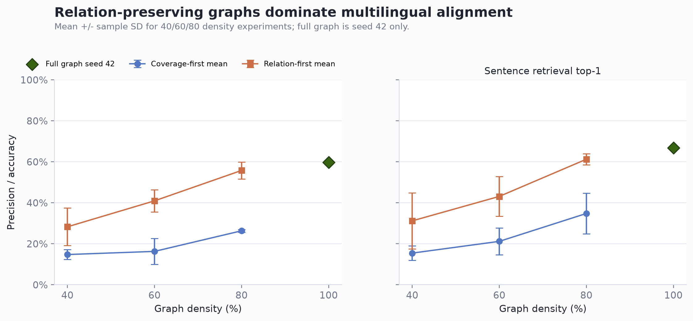
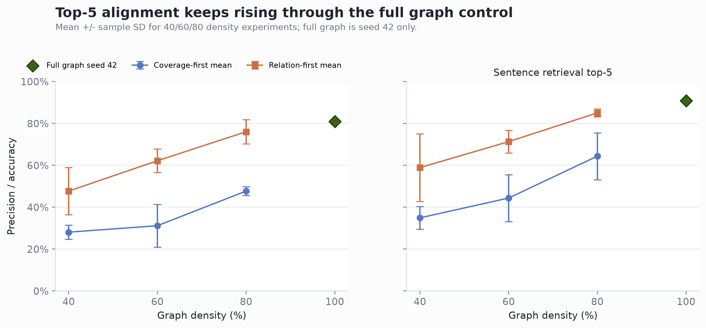
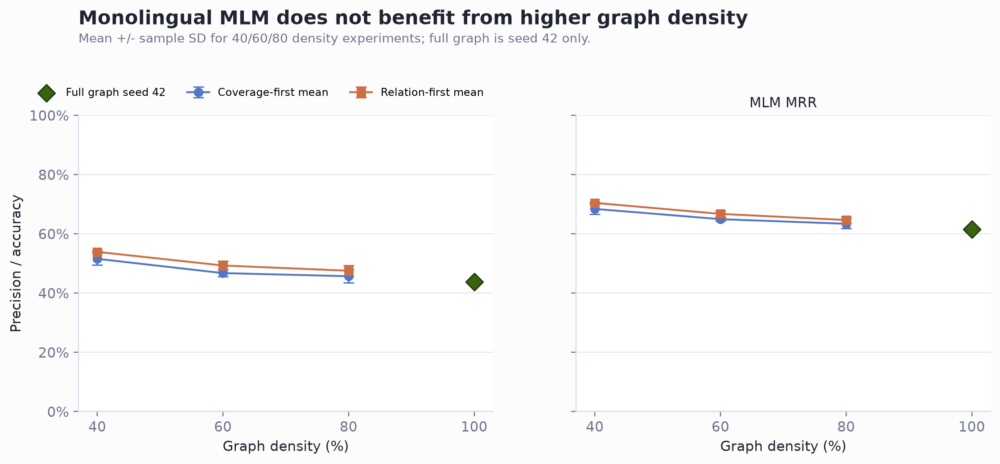

# Experiment Plan: Effect of Knowledge Graph Density on Cross-lingual Alignment

## Research Question

This experiment tests whether a denser semantic graph provides stronger
cross-lingual alignment signals for two artificial languages with distinct
surface vocabularies.

In this project, artificial languages are generated from semantic triples
extracted from WordNet and ConceptNet. The underlying semantic structure is
shared, while surface forms are replaced by artificial tokens.

The main question is:

> Does higher semantic graph density improve cross-lingual alignment, after
> controlling for training size and number of unique facts?

## Core Idea

Models are trained on corpora generated from pruned versions of the same full
knowledge graph. The full graph for this experiment is:

```text
data/semantic_backbones/edges_adj.json
```

All density conditions should be derived by pruning/subsampling edges from this
same full graph, not by rebuilding separate graphs. This keeps the concept
inventory, token dictionaries, grammar templates, and graph source consistent.
The node universe is the set of unique endpoints in `edges_adj.json`.

High-density graphs naturally contain more triples. If high-density models
perform better, the improvement could come from either:

1. More unique semantic facts.
2. Higher graph density / richer semantic neighborhoods.
3. More total sentence diversity.

To separate these factors, the experiment includes medium- and high-density
control conditions with the same number of unique training triples as the
low-density condition.

## Experimental Conditions

The current full graph has 7,181 edges and 2,042 endpoint nodes. The exact
counts should be computed from the input graph during data preparation, but the
expected condition sizes are:

| Condition | Graph source | Candidate edges | Training unique triples | Purpose |
| --- | --- | ---: | ---: | --- |
| `low_40` | 40% pruned full graph | about 2,872 | about 2,872 | Low-density baseline |
| `low_40_relation` | 40% relation-matched full graph | about 2,872 | about 2,872 | Low density with original relation proportions prioritized |
| `medium_60_full` | 60% pruned full graph | about 4,309 | about 4,309 | Medium density plus more facts |
| `medium_60_relation` | 60% relation-matched full graph | about 4,309 | about 4,309 | Medium density with original relation proportions prioritized |
| `medium_60_control` | 60% pruned candidate graph | about 4,309 | about 2,872 | Medium-density control with low-sized fact set |
| `medium_60_relation_control` | 60% pruned candidate graph | about 4,309 | about 2,872 | Medium-density control prioritizing relation proportions |
| `high_80_full` | 80% pruned full graph | about 5,745 | about 5,745 | High density plus more facts |
| `high_80_relation` | 80% relation-matched full graph | about 5,745 | about 5,745 | High density with original relation proportions prioritized |
| `high_80_control` | 80% pruned candidate graph | about 5,745 | about 2,872 | High-density control with low-sized fact set |
| `high_80_relation_control` | 80% pruned candidate graph | about 5,745 | about 2,872 | High-density control prioritizing relation proportions |

## Pruning Strategy

Low-, medium-, and high-density graphs are produced by pruning edges from the
same full graph.

The preferred pruning strategy is coverage-first edge sampling:

1. First select an edge cover so every concept node appears in at least one
   retained edge.
2. Then add edges until the target density is reached.
3. During the fill step, try to preserve relation and `source_type`
   distributions as much as possible.
4. Node coverage has higher priority than relation-distribution matching.
5. Record graph statistics in `metadata.json`.

The `*_relation` variants use relation-first sampling instead. They first match
the original graph's relation/source-type proportions as closely as possible,
then repair isolated nodes by edge replacement while keeping the target edge
count fixed. These variants are useful when relation distribution should be a
primary control.

## Corpus Generation

For each condition and seed, generate two artificial languages:

- Language A: CJK artificial tokens.
- Language B: Hiragana artificial tokens.

Use the same grammar, word order, and sentence-generation parameters across all
conditions. The default word order for this experiment is:

```text
order = SVO
```


## Training Protocol

For each condition, train a small BERT-style masked language model from scratch
on the mixed CJK + Hiragana corpus.

Training controls:

| Factor | Setting |
| --- | --- |
| Objective | Masked Language Modeling |
| Model architecture | Same small BERT encoder for all runs |
| Tokenizer | Fixed artificial vocabulary, no subword tokenization |
| Word order | Same in both languages |
| Surface overlap | No shared content tokens between CJK and Hiragana |
| Epoch sampling | Randomly sample the same number of sentences as the `low_40` corpus size from each condition corpus |
| Epoch count | Same for all runs |
| Seeds | 3 seeds per condition |

The per-epoch sentence budget is not fixed in advance. After the `low_40`
corpus is generated, its total sentence count becomes the matched per-epoch
sampling budget for all conditions.

Important: matching the number of sampled sentences per epoch controls training
updates per epoch, but it does not by itself control the total number of unique
facts seen across training. That is why all control variants fix the unique
training-triple pool to the same size as `low_40`.

## Evaluation

Evaluate whether graph density improves cross-lingual alignment and knowledge
transfer.

Primary evaluations:

1. Word translation precision.
2. Sentence retrieval precision.
3. Monolingual MLM accuracy

Report mean and standard deviation across seeds.

## Full Graph Control

A 100% full-graph control was added after the 40/60/80 density runs. This
condition uses the complete `data/semantic_backbones/edges_adj.json` graph, but
keeps the per-epoch sampled sentence count matched to the smallest low-density
corpus. This makes it a full-graph coverage comparison without increasing the
number of training examples per epoch.

### Full Graph Corpus

| Field | Value |
| --- | ---: |
| Full graph edges | 7,181 |
| CJK corpus sentences | 50,003 |
| Hiragana corpus sentences | 50,003 |

The CJK and Hiragana corpora were generated from the same PCFG sentence set.

## Evaluation Results

Evaluation was run with the existing repository scripts:

- `evaluation/word_trans_sent_retriev.py` for multilingual word translation and sentence retrieval.
- `evaluation/accuracy.py` for monolingual Hiragana MLM top-k accuracy and MRR.

All results below are mean +/- sample standard deviation across seeds 42, 43, and 44. Sentence retrieval uses `--n_sample 500`.

All results are visualized. Find them in [visualizations](visualizations).


### Multilingual Alignment

| Condition | Mode | Word top-1 | Word top-5 | Sentence top-1 | Sentence top-5 |
| --- | --- | ---: | ---: | ---: | ---: |
| `low_40` | `downsample` | 0.1255 +/- 0.0354 | 0.2460 +/- 0.0693 | 0.1507 +/- 0.0450 | 0.3513 +/- 0.0833 |
| `medium_60_full` | `downsample` | 0.1702 +/- 0.0199 | 0.3418 +/- 0.0203 | 0.1693 +/- 0.0336 | 0.4100 +/- 0.0452 |
| `medium_60_full` | `full_corpus` | 0.1703 +/- 0.0573 | 0.3307 +/- 0.0746 | 0.1927 +/- 0.0763 | 0.4280 +/- 0.1114 |
| `high_80_full` | `downsample` | 0.1895 +/- 0.0956 | 0.3587 +/- 0.1414 | 0.1973 +/- 0.1094 | 0.4347 +/- 0.1824 |
| `high_80_full` | `full_corpus` | 0.3855 +/- 0.0439 | 0.5853 +/- 0.0477 | 0.3693 +/- 0.0515 | 0.6640 +/- 0.0772 |
| `low_40_relation` | `downsample` | 0.2982 +/- 0.0595 | 0.4933 +/- 0.0713 | 0.2580 +/- 0.0730 | 0.5453 +/- 0.1139 |
| `medium_60_relation` | `downsample` | 0.3498 +/- 0.0782 | 0.5690 +/- 0.0928 | 0.2907 +/- 0.0965 | 0.5793 +/- 0.1299 |
| `medium_60_relation` | `full_corpus` | 0.5177 +/- 0.0974 | 0.7203 +/- 0.0862 | 0.5100 +/- 0.0399 | 0.7913 +/- 0.0197 |
| `high_80_relation` | `downsample` | 0.5192 +/- 0.0423 | 0.7323 +/- 0.0311 | 0.4640 +/- 0.0262 | 0.7447 +/- 0.0200 |
| `high_80_relation` | `full_corpus` | 0.6540 +/- 0.0416 | 0.8298 +/- 0.0251 | 0.6473 +/- 0.0314 | 0.8867 +/- 0.0356 |
| `full_graph` | `downsample` | 0.5255 +/- 0.0697 | 0.7433 +/- 0.0572 | 0.4560 +/- 0.0450 | 0.7553 +/- 0.0270 |
| `full_graph` | `full_corpus` | 0.7150 +/- 0.0277 | 0.8680 +/- 0.0114 | 0.7047 +/- 0.0219 | 0.9013 +/- 0.0162 |

**Visualizations**




### Monolingual Hiragana MLM Accuracy

| Condition | Mode | MLM top-1 | MLM top-5 | MRR |
| --- | --- | ---: | ---: | ---: |
| `low_40` | `downsample` | 0.5004 +/- 0.0170 | 0.9206 +/- 0.0007 | 0.6752 +/- 0.0083 |
| `medium_60_full` | `downsample` | 0.4737 +/- 0.0101 | 0.8881 +/- 0.0015 | 0.6482 +/- 0.0054 |
| `medium_60_full` | `full_corpus` | 0.4849 +/- 0.0048 | 0.9064 +/- 0.0071 | 0.6584 +/- 0.0033 |
| `high_80_full` | `downsample` | 0.4633 +/- 0.0101 | 0.8758 +/- 0.0093 | 0.6354 +/- 0.0085 |
| `high_80_full` | `full_corpus` | 0.4970 +/- 0.0128 | 0.9130 +/- 0.0037 | 0.6664 +/- 0.0068 |
| `low_40_relation` | `downsample` | 0.5501 +/- 0.0168 | 0.9413 +/- 0.0085 | 0.7138 +/- 0.0107 |
| `medium_60_relation` | `downsample` | 0.5048 +/- 0.0008 | 0.9119 +/- 0.0159 | 0.6761 +/- 0.0024 |
| `medium_60_relation` | `full_corpus` | 0.5335 +/- 0.0056 | 0.9302 +/- 0.0098 | 0.7000 +/- 0.0031 |
| `high_80_relation` | `downsample` | 0.4929 +/- 0.0057 | 0.8829 +/- 0.0018 | 0.6578 +/- 0.0038 |
| `high_80_relation` | `full_corpus` | 0.5213 +/- 0.0021 | 0.9200 +/- 0.0048 | 0.6879 +/- 0.0046 |
| `full_graph` | `downsample` | 0.4691 +/- 0.0067 | 0.8597 +/- 0.0031 | 0.6351 +/- 0.0057 |
| `full_graph` | `full_corpus` | 0.5141 +/- 0.0056 | 0.9101 +/- 0.0068 | 0.6793 +/- 0.0064 |

**Visualizations**
